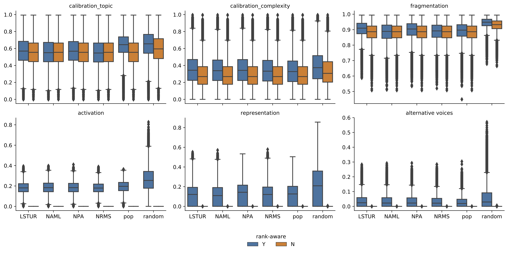

This repository contains the supporting material for the paper *RADio – Rank-Aware Divergence Metrics to Measure Normative Diversity in News Recommendations*.

```{r setup, include=FALSE}
knitr::opts_chunk$set(echo = F, warning = F, message = F)
library(knitr)
library(kableExtra)

```

# Jensen Shannon as an f-Divergence

```{r}
include_graphics("viz/JSasF.pdf")

```

# RADio with KL divergence

```{r}

d <- read.csv("viz/meanTableKL.csv")
kable(d[,2:8], digits = 4, caption = "RADio framework with DART metrics based on KL divergence with recommendation algorithms on the MIND dataset. From left to right:  Calibration (topic), Calibration (complexity), Fragmentation, Activation, Representation and Alternative Voices. These metrics are executed on a random sample of 35.000 users, with rank-awareness, and without cutoff point.")
```

# Jensen-Shannon divergence Kullback-Leibler divergence with and without rank-awareness

```{r, fig.cap="Jensen-Shannon divergence for each DART metric, with and without rank-awareness, with a cutoff @10. Boxplot with median and the interquartile range in the inner box."}
include_graphics("viz/figs/KL.pdf")

```

```{r, fig.cap="Kullback-Leibler divergence for each DART metric, with and without rank-awareness, with a cutoff @10. Boxplot with median and the interquartile range in the inner box."}
include_graphics("viz/figs/JS.pdf")

```


# Jensen-Shannon divergence for all recommender strategies without cutoff

```{r, fig.cap="Jensen-Shannon divergence for each DART metric for all neural recommender strategies, with and without rank-awareness, and without a cutoff. Without rank-awareness and cutoff no divergence is found for the Activation, Representation and Alternative Voices metrics, as in these cases the recommendation and the context are identical. Boxplot with median and the interquartile range in the inner box."}

```


